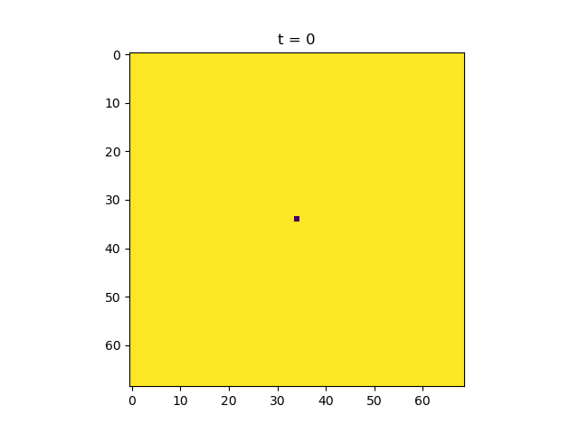
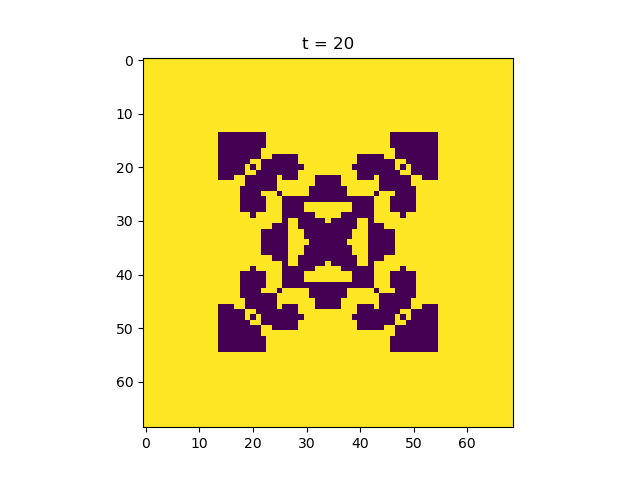
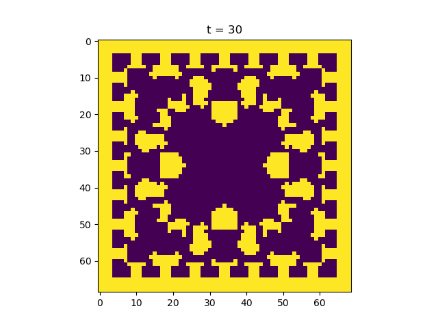
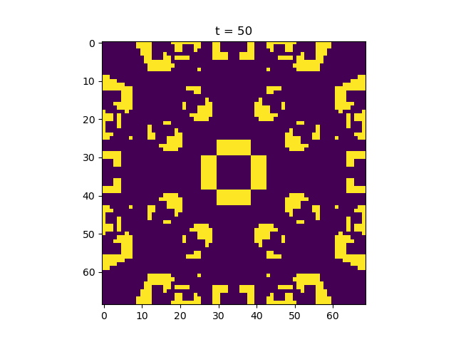

---
title: TEK9010 - Evolutionary Dynamics
author: Sebastian G. Winther-Larsen
date: \today
mainfont: DejaVuSerif.ttf
geometry: margin=2cm
fontsize: 16pt
header-includes:
    - \usepackage{setspace}
references:
    - type: article-journal
      id: nowakSpatial
      author:
      - family: Nowak
        given: M.
      - family: May
        given: R.
      issued:
        date-parts:
        - - 1993
      title: 'The spatial dilemmas of evolution'
      container-title: World Scientific
      volume: 3
      issue: 01
      page: 35-78
...

# Quasispecies Theory

You need to incorporate three basic principles in order to model evolution;
*reproduction*, *selection* and *mutation*. In the world of mathematical 
biology, we normally assume some sort of asexual reproduction.
$$
    \dot{x} = \frac{\partial x}{\partial t} = rx
$$
The solution of this equation is exponential growth,
$$
    x(t) = x_0 = e^{rt},
$$
but may be checked by resource limitation.
Selection arises when different types of individuals reproduce at different rates.
$$
    \dot{x} = x(a - \phi),
$$
$$
    \dot{y} = y(b - \phi), 
$$
such that $a \neq b$. The term $\phi$ ensures that $x + y = 1$, which is only possible if 
$\phi = ax + by$. We may echange the values $a$ and $b$ with fitness values 
$f_i$, in the general case of $n$ types of individuals,
$$
    \dot{x}_i = x_i(f_i - \phi).
$$
Mutation arisis when reproduction is not perfectly accurat, such that 
an individual of type $i$ can transition to an individual of type $j$
in reproduction. This is is modelled by the mutation matrix $Q = [q_{ij}]$,
which is a stochastic $n\times n$ matrix.

The quasispecies equation incorporates all of these concepts 
of reproduction, selection and mutation,
$$
    \dot{x}_i = \sum_{j=1}^n x_i f_i Q_{ij} - \phi (\mathbf{x}) x_j.
$$
This equation gives the rate of change over time $\dot{x}_i$, i.e.
the time derivative of the frequency of an individual of species $i$.
The first term on the right-hand side contains the sum of product of 
all other individual frequencies $x_j$, the fitness $f_j$ and the
mutation rate $Q_{ij}$ from species $i$ to $j$. The fitness is also 
called the reproductive rate of the organism, which is determined 
by phenotype of the organism. The average fitness is given by 
$\phi(\mathbf{x}) = \sum_i f_i x_i$.

The quasispecies equation describes deterministic evolutionary dynamics
in terms of mutation and constant selection acting on an infinitely large
population. Generally, the quasipsecies equation has one global equilibrium,
consisting of a distribution of genomes in a mutation-selection balance.

# Evolutionary Game Dynamics

In game theory, games can be formulated in 
terms of a payoff matrix, which specifies the payoff for one strategy when interacting
with another. 

--- --- ---
     A   B 
 A   a   b 
 B   c   d 
--- --- ---

:Pay-off matrix with interacting strategies $A$ and $B$, with different 
payoffs $a$, $b$, $c$ and $d$, dependent on choice. \label{payoff_matrix}

In evolutionary games we interpret the payoffs as fitness - a better 
strategy would lead to faster reproduction.

In game theory it is absolutely necessary to define the Nash equlibirium. 
If each player has a chosen strategy, and no player can increase its own expected payoff
by changing its strategy while other players keep their unchanged,
then the current set of strategy choices consitutes a Nash equilibrium.
The Nash equilibrium is related to the evolutionary stable stratgy (ESS).
In general, for games with more than two strategies, we can define the 
two concepts in the following way. If $E(S_i, S_j)$ is the expected payoff 
for strategy $S_i$ versus $S_j$, then;

- Strategy $S_k$ is a strict Nash 
equilibrium if $E(S_k, S_k) > E(S_i, S_k)$ for all $i \neq k$,
- Strategy $S_k$ is a (non-strict) Nash eqmuilibrium if
$S(S_k, S_k) \geq S(S_i, S_k)$ for all $i$, 
- Strategy S_k is ESS, if for all $i \neq k$ we have either
$E(S_k, S_k) > E(S_i, S_k)$ or 
$E(S_k, S_k) = E(S_i, S_k)$ and $E(S_k, S_i) > E(S_i, S_i)$.
- Strategy $S_k$ is stable against invasion by selection ("weak ESS")
if for all $i \neq k$ we have either
$E(S_k, S_k) > E(S_i, S_k)$ or 
$E(S_k, S_k) = E(S_i, S_k)$ and $E(S_k, S_i) \geq E(S_i, S_i)$.

Note; strict Nash implies ESS implies weak ESS implies Nash.


The replicator equation is the cornerstone of evolutionary game dynamics,
$$
    \dot{x}_i = x_i[f_j(\mathbf{x}) - \phi(\mathbf{x})].
$$
It describes deterministic evolutionary game dynamics. For $n=2$ strategies,
there can be dominance, coexistence, bistability or neutrality. For $n\geq 3$
strategies, there can be heteroclinic cycles. For $n\geq 4$, there can be 
limit cycles and chaos. The replicator equation with $n$ strategies
$$
    \dot{x}_i = x_i\left[\sum_{j=1}^n a_{ij}x_j - \phi(\mathbf{x})\right].
$$
is equivalent to the Lotka-Volterra equation from ecology,
$$
    \dot{y}_i = y_i\left(r_i + \sum_{j=1}^{n-1} b_{ij}y_j  \right),
$$
with the parameters $r_i = a_{in} - a_{nn}$ and $b_{ij} = a_{ij} - a_{nj}$.


# Prisoner's Dilemma and Cooperation

--- --- ---
     C   D 
 C   R   S  
 D   T   P 
--- --- ---

:A payoff matrix depicts a prisoner's dilemma game if $T>R>P>S$.

In a prisoner's dilemma game you can either cooperate (C) or defect (D).
Defection is "rational", because it maximises the payoff. But, if 
my opponent analyses the game the same way that I do, the we both
choose defection which leads to a suboptimal payoff. The social optium 
does not provide the highest payoff for the individual. Thus, the 
prisoner's dilemma captures the essence of cooperation and how defection 
can dominate.

The repeated Prisoner's dilemme is a tool for studying direct reciprocity,
which represents a mechanics for the evolution of cooperation. In a 
series of "tournaments", Robert Axelrod invited participants to submit 
strategies for a repeated game. The clear winner in these tournaments 
was the simple Tit-for-Tat (TFT) statetegy. 
TFT starts with a cooperation,
then does whatever the oponent did the previous round. TFT has a couple 
of weaknesses. 

----- ------------------ -----------------
       TFT                ALLD 
 TFT   $\bar{m}R$         $S+(\bar{m}-1)P$ 
 ALLD  $T+(\bar{m}-1)P$   $\bar{m}P$ 
------ ----------------- ------------------

:Tit-for-Tat (TFT) payoff against Always Defect (ALLD). The expected number of 
rounds played is given by $\bar{m}$.

TFT cannot prevent netutral drift leading to Always Cooperate
(ALLC) and it cannot correct mistakes.

An improvement on TFT is the Generous TFT (GTFT). This strategy 
cooperate whenever the oponent has cooperated and sometimes even cooperates
when the oponent has defected. It is therefore able to correct mistakes.

In a repeadted PD game where one allow for evolution of reactive strategies,
it is revealed that TFT is a catalyst for cooperation, but will be 
replaced by GTFT. Both of these strategies are outcompeted by Win-stay,
lose-shift (WSLS), which can correct mistakes and is stable against neutral 
drift to ALLC.

# Stochastic Description of Finite Populations

An imporant concept in stochastic theory describing populations 
of finite size, is the Moran process.
The Moran process is a birth-death process:
Pick one individual for reproduction and one for death. 
The offspring of the first individual replaces the second. The individual can 
be the same. We typically have two types of individuals, A and B.

An interesting process to model is the one where the initial state is one A 
individual and $N - 1$ B individuals. The probability that A takes over the 
whole population is called the fixation probability. This is interesting
because it says something about the likelihood that 
a mutation can take over the whole population.

In a population of size $N$, a neutral mutant will reach fixation with 
probability $1/N$. A mutant with realtive fitness $r$, will 
reach fixation with probability $\rho = (1 - 1 / N) / (1 - 1/r^N)$.
Introducing fitnes to this kind of model makes things more interesting,
as we could model a situation where the mutation is favoured.
If the mutation rate is constant, then neutral mutations accumulate 
at a constant rate, in effect introducing a "molecular clock".

## Games in Finite Populations

Extension of the Moran process provides a framework for studying
evolutionary game dynamics for populations of a finite size.
Computing fixation probabilities can determine if a selection one strategy 
over another. The payoff's of the game makes a contribution to the fitness 
and therefore the selection. We differentiate between strong- and weak
selection regimes.

Consider a standard payoff matrix in table \ref{payoff_matrix}.
Natural selection would favour $A$ replacing $B$ if $b > c4 in a 
sufficiently small population. Moreover, natural selection 
favours $A$ replacing $B$ in a sufficiently large population, and 
_weak_ selection, provided $a + 2b > c + 2d$.

Intensity of selection is implemented by introducing a parameter $w \in [0,1]$.
The fitness of $A$ and $B$ is then given by
$$
    f_i = 1 - w + wF_i,
$$
and
$$
    g_i = 1 - w + wG_i,
$$
with $F_i$ and $G_i$ representing functions for the expected payoffs 
for $A$ and $B$, respectively.

There is a surprising $1/3$ law for evolutionary games in finite populations.
If $A$ and $B$ are best counters to themselves, i.e. $a>c$ and $b< d$,
The unstable equilibrium of the replicator equation is 
$$
    x^* = \frac{d - b}{a - b - c + d}.
$$
If $x^*< 1/3$ then the fixation probability is $\rho > 1/N$.
In other words, a strategy has a fixation probability higher than $1/N$, 
if it has a higher fitness at frequency $1/3$. This holds only for weak
selection and a large population size.

The traditional ESS and Nash equqilibria are neither necessary nor sufficient 
to imply protection by selection in finite populations.
There are special ESS that hold for finite population size $N$.
Strategy $B$ is ESS$_N$ if

1. Selection opposes $A$ invading $B$, $b(N-1) < c + d(N-2)$,
2. Selection opposes $A$ replacing $B$, $a(N - 2) + b(2N - 1) < c(N + 1) + d(2N - 4)$

Game dynamics change for finite populations. Natural selection can favor the replacement
of ALLD by a cooperative strategy such as TFT, when starting from a 
single individual using that strategy.

# Evolutionary Graph Theory

A graph can represent the spatial configuration of a population, the 
differentiation hierarchy of cells in a multicellular organism, or 
a social network. Individuals are placed on the vertices of the graph and
the edges of a graph determine competitive interaction. All invividuals of 
the population are labelled $i\ in [0,N]$, at each time step, an individual 
is chosen for reproduction. The probability that the offspring of $i$ replaces 
$j$ is $w_{ij}$, i.e. the process is determinded by an $N \times N$ matrix $W$,
where all entries are probabilities. The Moran process is given by the 
_complete graph_ with identical weights.

The temperature of a vertex is given by,
$$
    T_j = \sum_{i=1}^N w_{ij}.
$$
If all vertices have the same temperature, then the fixation probability is 
equivalent to the Moran process. This is called the isothermal theorem.

The cycle and directed cycles are isothermal. All symmeric graphcs 
$w_{ij} = w_{ji}$ are isothermal.

Special graphs can both amplify and reduce selection. Amplifiers increase 
the fixation probability of advantageous mutants and reduce the fixation 
probability of disadvantageous mutants. Supressor graphs have 
selection mechanics that function in the opposite manner.

Games on graphs can be studied by assuming that individuals interact with their 
nearest neighbors an thereby acumulate payoff. Some games are the birth-death, 
death-birth and imitation process games. A simple rule for evolution
of cooperation on graphs is $b/c>k$; selection favours cooperation fi the 
benefit-to-cost ratio exceeds the number of neighbors.

# Spatial Games

Evolutionary games can be studied in a spatial setting, where players interacting with
their nearest neighbors. It is possible to formulate entirely deterministic spatial
game dynamics. In spatial games, the theory of cellular automata meets game theory.
Visualisation of spatial games make some pretty picures. In some parameter regions,
we discover spatial chaos, dynamic fractals and evolutionary kaleidoscopes.

An implementation of a spatial game is the spatial prisoner's
dilemma, where the payoff matrix is a bit simplified (table \ref{tab:spatial_PD}).

--- --- ---
     C   D 
 C   1   0  
 D   b   0 
--- --- ---

:Spatial prisoner's dilemma payoff matrix. \label{tab:spatial_PD}

Each individual has eight surrounding neighbors, for which a payoff is computed.
A cooperator surrounded by 8 cooperators recieves payoff 8.
A defector surrounded by 8 cooperators receives payoff 8b.
Martin Nowak has studied such games extensively [@nowakSpatial].

I have written a class in Python that can simulate such games, included in 
an abridged form here. 
Please find full code at https://github.com/gregwinther/mas, together with a nice animated gif. 
The figures below show a few snapshots from a simulation with this script at 
specific time points, for a simulation starting from a single defector, on an $N\times N$ lattice
with $N=69$, $b=1.61$ and periodic boundary conditions.

{width=330px}
{width=330px}

{width=330px}
{width=330px}

\pagebreak
\small
```python
class Board:

    def __init__(self, N=2, b=1.5):
        self.N = N
        self.b = b
        self.lattice = np.ones((N, N))
        self.payoff_lattice = np.zeros((N, N))

    def set_up_simple_square(self):
        self.lattice = np.zeros((self.N, self.N))
        self.lattice[self.N//2, self.N//2 - 1] = 1
        self.lattice[self.N//2 - 1, self.N//2] = 1
        self.lattice[self.N//2 - 1, self.N//2 - 1] = 1
        self.lattice[self.N//2, self.N//2] = 1

    def set_up_single_defector(self):
        self.lattice = np.ones((self.N, self.N))
        self.lattice[self.N//2, self.N//2] = 0

    def advance(self):
        old_strategies = self.lattice.copy()

        self.compute_payoffs()
        for i in range(self.N):
            for j in range(self.N):
                dir = self.dir_happiest_neighbor(i, j)
                coords = self.move(dir, i, j)
                # Change strategy if someone did better
                if self.payoff_lattice[coords] > self.payoff_lattice[i, j]:
                    self.lattice[i, j] = old_strategies[coords]

    def set_up_random(self):
        self.lattice = (np.random.rand(self.N, self.N) > 0.5).astype(int)

    def compute_site_payoff(self, i, j):
        
        # Am I cooperating?
        payoff_multiple = 1 if self.lattice[i, j] else self.b

        payoff = 0

        for dir in range(8):
            payoff += self.lattice[self.move(dir, i, j)]

        return payoff * payoff_multiple

    def compute_payoffs(self):
        for i in range(self.N):
            for j in range(self.N):
                self.payoff_lattice[i, j] = self.compute_site_payoff(i, j)

    def dir_happiest_neighbor(self, i, j):
        values = []

        for dir in range(8):
            values.append(self.payoff_lattice[self.move(dir, i, j)])

        best_dir = np.asarray(values).argmax()

        return best_dir
```
\normalsize

