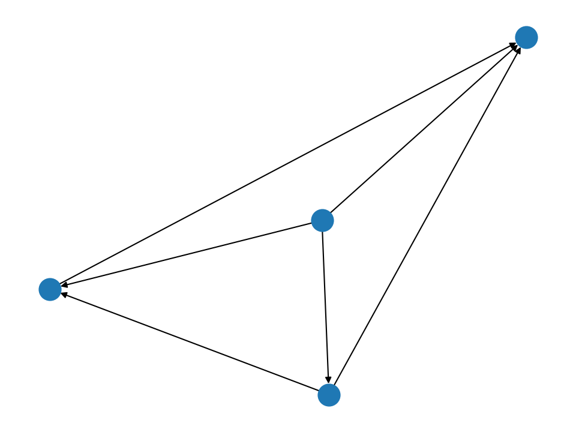

---
title: TEK9010 - Exam prep summary
author: Sebastian G. Winther-Larsen
date: \today
...

# 0: General concepts in multiagent systems

## Agents

Definition from Woolridge: "An agent is a computer 
system that is situated in some environment,
and that is capable of autonomous action in this 
environment in order to meet its delegated objectives."

An agent is a computer system capable of independent action 
on behalf of its owner or user. Agents need skills and 
abilities to cooperate, coordinate and negotiate with 
each other on behalf of their users.

We deal with two different kinds of agents,

1. Reactive (or simple) agents can produce emergent properties 
usually modelled by Swarm Intelligence (SI). These can produce 
complex collective properties/performance.
2. Strategic (or intelligent) agents engage in social activities
like cooperation, coordination, negotiation, etc usually
described with Game Theory (GT). These engage in strategic
interaction.

In some situations an agent-based solution would be appropriate.

1. The environment is open, or at least highly dynamic,
uncertain or complex. In these settings autonomous agents 
might be the only solution.
2. Agents are natural metaphors for
socities, organisations and businesses, as well as intelligent 
interfaces such as "expert assistants". 
3. In istribution of data, control or expertise. When centralised 
solutions are difficult, like synchronisation of many 
autonomous databases.
4. When dealing with legacy software, one can wrap the 
legacy software in an agent layer.

## Multiagents systems

Multiagent systems consists of many agents interacting with 
each other through some network or sensor system. Definition
from Woolridge: "Multiagent systems are systems of 
multiple interacting computing elements known as agents."

Multiagent systems is an appropriate software paradigm 
for modelling and building massive open and complex distributed
systems. It is also a natural metaphor for artificial
social systems. The research goal of multiagents systems 
is to connect behaviour on the microscopic scale with (often)
emergent properties and effects on the macroscopic scale.

There are some key challenges associated with multiagent system
desing.

1. The agent design problem on the microscopic level. How do we
build agents that are capable of independent, autonomous 
action in order to successfully carry out tasks that we
delegate to them?
2. The social desgin problem on the macroscopic level.
How do we build agents that are capable of intercating with other
agents in order to successfully carry out the tasks that we delegate
to them, especially when the agents do no share common goals 
or intentions?

A truly succesful multiagent system makes an explicit connection
between the autonomous micro level agents and the macro level 
modelling of the complex system.

Mutliagent system applications can be divided into two groups,

1. Distributed systems, where agents are processing nodes in a
distributed multiagent system (emphasis on "multi").
2. Personal software assistants, where individual agents act as
proactive assistants to users (emphasis on "individual").

## Swarm intelligence

Swarm Intelligence (SI) is the emergent collective intelligence 
of groups of simple agents, typically based on the social insect metaphor.
This differs from Game Theory where agents are modellled as engaging in
strategic interaction, typically inspired by utility-based models in the 
social sciences.

In terms of multiagents systems (MAS) there are some key similarities between
the two paradigms. Both SI and GT model autonomous agents, which is 
the only requirement in MAS, and both SI and GT employ distributedness, i.e.
there is no central control. These two points are actually the same. 
Some key differences are that SI use simple, reactive agents vs strategic,
proactive, social agents in GT.

Emergence and stigmergy are two properties that are unique to SI.

## Stigmergy

Stigmergy is indirect, non-symbolic interaction mediated by the environment.
Agents can use stigmergy to excange information by modifying the 
environment. This concet does not exist in game theoretical framework,
because one assumes direct communication between agents.

## Emergence

Emergence is an important in SI. 

# 1: Non-cooperative game theory

## Different types of games

REMEMBER TO LOOK THROUGH A FEW EXAMPLES,
including payoff matrices before exam.

### Cooperative / non-cooperative

A game is _cooperative_ if the players are able to form binding commitments
that are externally enforced. This external force can stem from contractual 
law or a some government. A game is _non-cooperative_ if players cannot form
or if all agreemetns need to be self-enforcing, e.g. through credible threats.

### Symmetric / asymmetric

A symmetric game is a game where the payoffs for playing a particular 
strategy depend only in the other strategies employed, not on who
is playing them. If the identities of the players can be changed without
changing the payoff to the strategies, the game is symmetric. 
Chicken, Prisoner's Dilemma and Stag Hunt are all symmetric games.

The most commonly studied asyummetric games are games where there are not
identical strategy sets for both players. For instance, the Ultimatum Game 
and the Dictator Game have different strategies for each player. It is 
possible for a game to have identical stratgies for both (all) players,
yet be asymmetric.

### Zero-sum games

Zero-sum games are a special case of constant-sum games in which choices by
players can neither increase nor decrease the available resources.
In zero-sum games, the total benefit to all players in the game, for 
every combination of strategies, always adds to zero. One can say that a
player only benefits at equal expense of others.

Matching Pennies, poker and chess are all zero-sum games. Many games 
studied (like Prisoner's Dilemma), are not zero-sum games because  the outcome
has net results greater or less than zero.

Constant-sum games correspond to activities like theft and gambling, but not to
the fundamental economic situation in which there are potential gains from trade.
It is possible to transform any game in to (possibly asymmetric) zero-sum game 
by adding a dummy player whose losses compensate the players' net winnings.

### Simultaneous / sequential

_Simultaneous_ games are games where both (all) players move simultaneously, or 
at least unaware of the other player(s)' earlier action. _Sequential_ games
or dynamic games, are games where players ahev some knowledge about earlier
actions. 

### Evolutionary game theory

Evolutionary game theory studies players who adjust their strategies over time
according to rules that are not necessarily rational or farsighted. The fitness
of individuals is not constant in evolutionary games, but depends on relative
proportions or frequencies of the different phenotypes in the population.

The evolution of strategies over time is typically modelled as a Markov chain
with a state variable such as the current strategy profile or how the game 
has been palyed in the recent past.

### Behavioural game theory

Behavioural game theory analyzes interactive strategic decisions and behaviour using 
methods of game theory, experimental economics and experimental psychology. 
Experiments include testing deviations from typical simplifications of economic 
theory such as the independence axiom and neglect altruism, fairness and framing 
effects.

## Self-interested agents

Agents have their own desires, preferences and beliefs. They 
seek to maximise their expected utility,
$$
    Ag_\text{opt} = \max \sum u(r) P(r|Ag, Env),
$$
where $r$ is a "run". Whatever that means. This equation comes 
from the Tileworld example.

What is more, agent beliefs are modelled by information processes.

There is talk about a set of outcomes that an agent can experience,
$$
    \Omega = \{\omega_1, \omega_2, \dots\}.
$$

## Utility

The utility of an agent is a valuable associated with an outcome,
$$
    u_i: \Omega \to \mathbb{R}
$$
where $u_i$ is the utility of agent $i$, $\Omega$ is the set of possible 
outcomes, $\mathbb{R}$ is the set of real numbers.

Utility function is a way of representing an agent's preferences. Utility does
not directly equate to money, but it helps to think of money.
The utility value fo money is typically diminishing. An increase in utility 
from \$0 to \$1m is much greater than from \$500m to \$500m. You can make an
inverse argument regarding debt.

Agents are able to rank outcomes by applying their utility function,
$$
    u_i(\omega_k) \geq u_i(\omega_l) \iff w_k \succeq_i w_l
$$
means that agent $i$ prefers outcome $\omega_k$ to $\omega_l$, or 
is indefferent, whil
$$
    u_i(\omega_k) > u_i(\omega_l) \iff w_k \succ_i w_l,
$$
means that agent $i$ strictly prefers outcome $\omega_k$
$\omega_l$.

Here are some important properties of preference ordering.

1. Reflexivity: $\omega \succeq_i \omega$ $\forall \omega \in \Omega$
2. Transivity: $\omega_k \succeq_i \omega_l,\ \omega_l \succeq_i \omega_m \implies \omega_k \succeq_i \omega_m$
3. Comparability:
Either $\omega_k \succeq_i \omega_l$ or $\omega_l \succeq_i \omega_k$ $\forall \omega \in \Omega$.

## Strategic interaction

The environment is altered in simultaneous actions by agents.
The basic idea of strategic interaction:

> What I do depends on what you do, and what you do depends on what I do, which 
> we should both have taken into account in the first place.

One can assume that agents must act and that agents can not see other 
agents perform actions, in the scope of this course.

Mathematically we can write,
$$
    \tau: Ac_i \times Ac_j \to \Omega,
$$
where $\tau$ is the state transformer function, $Ac_i$ is the action of 
agent $i$ and $\Omega$ is the set of outcomes.

The simplest strategic game conceivalbe consists of two agents, $i$ and $j$,
with two actions available, Cooperate ($C$) or Defect ($D$). This gives us 
four different combinations of actions,
$$
    (C,C)\lor(C,D)\lor(D,C)\lor(D,D)
$$
with four different outcomes,
$$
   \tau(C, C)=\omega_1,\ \tau(C, D)=\omega_2,\  \tau(D, C)=\omega_3,\ \tau(D, D)=\omega_4,
$$
that is,
$$
    \Omega = \{\omega_1, \omega_2, \omega_4, \omega_4\}.
$$
The agents $i$ and $j$ will value these outcomes according to their utility functions,
$u_i$ and $u_j$.

An interaction is said to be strictly competitive between agent $i$
and agent $j$ when
$$
    \omega \succ_i \omega' \land \omega' \succ_j \omega.
$$

------- ------------------- ------------------
i \\ j   D                   C
D       $u_{i4}$, $u_{j4}$  $u_{i3}$, $u_{j3}$
C       $u_{i2}$, $u_{j2}$  $u_{i1}$, $u_{j1}$
------- ------------------- ------------------

:Payoff matrix. This is a game on strategic (or normal) form.
The extensive form would be a game tree.

## Solution concepts for simple games

A set of concepts for solving games on
strategic from;

1. Maximising social welfare
2. Pareto effiency
3. Dominant strategy
4. Nash equilibrium

Social welfare is given by the sum all all utilities
for a particular outcome $\omega_i$,
$$
    sw(\omega_i) = \sum_{j\in Ag} u_j(\omega_i).
$$
By choosing strategies that would maximise this function we
have an outcome that gives the highest aggregated utility
across agents.

A solution is Pareto efficient (or Pareto optimal) if 
no improvement is possible without making someone else 
worse off.

A strategy $s$ for agent $i$ is dominant if $s$ is the best
response to all of the opposing agent $j$'s strateiges.
There is no geuarnatee that such a solution exists.

### The Nash equilibrium

If each agent has chosen a strategy, based on what they other 
player(s) is doing, and no agent can increase its own expected 
payoff by changing its strategy while the other players keep
theirs unchanged, then the current set of strategy choices 
constitutes a Nash equilibrium.

The two strategies $s_i$ and $s_j$ of agents $i$ and $j$ are in
Nash equilibrium,

1. if agent $i$ plays $s_i$, player $j$ can do no better than
playing $s_j$ and
2. if agent $j$ plays $s_j$, player $i$ can do no better than
playing $s_i$.

$s_i$ ans $s_j$ are best repsonses to the other and no agent
regrets its strategy choice.

A Nash equilibrium is _weak_ if a change of strategy would yield
the exact same output. If there is only one Nash "equilibrating"
strategy, we have a _strict_ Nash equilibrium. A game can 
have a pure-strategy or a mixed-strategy Nash equilibrium.
A _pure strategy_ provides a complete definition of how a player will
play a game. A _mixed strategy_ is an assignment of a probability
to each pure strategy. This allows for a player to randomly 
select a pure strategy. A _totally mixed_ strategy is a mixed
strategy in which the agent assigns a strictly positive 
probability to every pure strategy.

Nash's theorem states that every game in which every agent has 
a finite set of possibilities has a Nash equilibrium in mixed
strategies.

## Prisoner's Dilemma

Two man are collectively charged with a crime and held in separate
cells. They have no way of communicating with each other or 
making any kind of agreement. The two men are told that if one
of the confesses the crime and the other does not, the confessor
will be freed, and the other will be jailed for 3 years. If
both confess to the crime, then each will be jailed for 2
years. If neither prisoner confesses they will be jailed for 
1 year.

---- ---- ----
      C     D
C    -1    -3   
D     0    -2
---- ---- ----

:Payoff-matrix for agent $i$ in PD.

This is a dilemma, because the Nash equilibrium is also the worst
social outcome.

You should also add some utilities etc!!

Some important real-world examples of PD are the "Tragedy of 
the commons", like grazing livestock, overfishing of the seas and 
capacity bandwidth on the Internet. Nuclear weapons treaties and 
international environmental agreements as well. Perhaps any 
game with positive externalities?

## Repeated PD

Repeating PD over several rounds will increase the change
of cooperation, because of the threat of "punishment" by 
defecting in susequent rounds and because loss of utility
can be amortized over several rounds.

If there are infinite rounds in the repeated PD game,
cooperation is rational due to threat of defection.
If the number of rounds is a fixed number, it is rational 
to defect in the last round. That in turn makes it 
rational to defect in the second-to-last round. 
Go figure.
If there is a probability for playing another round it 
is rational to cooperate if the probability of one more 
round is large enough compared to the payoffs.

# 2: Voting

## Social choice theory

In a basic setting we have a set of agents,
$$
    Ag = \{1, 2, \dots, N\},
$$
where the number of agents $|Ag| = N$ is assumed to
be finite and odd, in order to break ties. We also 
have a set of possible outcomes,
$$
    \Omega = \{\omega_1, \omega_2, \dots\},
$$
where $|\Omega| = k$ is the number of possible
outcomes. In a pairwise election $k=2$ and 
in a general election $k \geq 2$.

For each (voting) agent $i$ we have a preference ordering,
$$
    \bar{\omega}_i = (\omega_3, \omega_1, \dots, \omega_k).
$$
Preference aggregation is the fundamental problem in social choice theory.
How do we combine the different agents' preference orderings in order 
to derive a group decision? More specific, how do we generate a 
social preference order over possible outcomes?

We need a _social welfare function_ that takes the voter preferences 
and produces a social preferences order,
$$
    f: \Pi(\Omega)\times\dots\Pi(\Omega)\times \to \Pi(\Omega).
$$
We will also use $\omega \succ^* \omega'$ to indicate that $\omega$
is ranked over $\omega'$ in the social outcome.

Sometimes, we will be concerned with slightly simpler settings, in
which we are not concerned with obtaining an intire ordering, but just
one of the possible candidates. We use the term _social choice function_
for such a mapping,
$$
    f: \Pi(\Omega)\times\dots\Pi(\Omega)\times \to \Omega.
$$

## Plurality voting

In plurality voting, every voter submits their preference order and 
the winner is the otucome ranked first most times. This is the 
simplest and best known voting procedure. Plurality is
straightforward to implement and easy to understand by the voters.
However, plurality is vulnerable to strategic manipulation
and tactical votion. Additionally it reveals Condorcet's paradox.

## Simple majority voting

If we only have two outcomes to choose between, then plurality is 
just _simple majority voting_. In this case, we simple ask voters 
to select one of the two outcomes, and the one that gets the 
majority of votes is the winner. Simple majority voting is 
not very easy to manipulate. In reality there are often more
than two possible outcomes..

## Sequential majority election

In a _sequential majority election_ a series of plurality elections 
are conducted to determine a winnder. The idea is that a pair of
outcomes will face each other in pairwise election, and the winner will
then go on to the next election. These sequential pairwise elections 
can be arranged into linear order of ballots, or a binary tree 
election.

Suppose we are voting over four outcomes $\omega_1$, $\omega_2$,
$\omega_3$ and $\omega_4$. We might choose the following order
or _agenda_ for the election,
$$
    \omega_2, \omega_3, \omega_4, \omega_1. 
$$
We could have the first election between $\omega_2$ and $\omega_3$,
then the winner would face $\omega_4$ and so on. This is a 
_linear order_. If we structured the election as _balanced binary tree_,
we would have simultaneous elections, e.g. the winner
between $\omega_2$ and $\omega_3$ would face the winner betwen $\omega_4$
and $\omega_1$.

Bear in mind that the ultimate outcome is generally sensitive to the 
election agenda, or voting order.

## Borda count

For each of the possible candidate outcomes $|\Omega| = k$, we have a numerical 
value counting the strength of opinion in favour of this candidate. If an outcome
$\omega_j$ appears first in the preference order, we increment the count for 
$\omega_j$ by $k - 1$, we then increment the count for the next outcome by 
$k - 1$ and so on until the final outcome in the preference order is incremented 
by 0. We proceed with this process until all preference orders have been 
considered, and then simply order the outcomes $\Omega$ by their counts,
in descending order.

The Borda count (BC) for outcome $\omega_j$ is given by
$$
    BC_{\omega_j} = \sum_{i=1}^N k - \text{rank}\left(\bar{\omega}_i (\omega_j) \right),
$$
where $k = |\Omega|$ is the number of possible outcomes, $N$ is the number of voters
and $\bar{\omega}_i$ is the social preference order of voter $i$.

## Slater rule

READ THROUGH THE example in the book closely (p.260).

The Slater rank is used for breaking cycles in majority graphs. The Slater rank 
for a social ordering is how many edges must be "flipped" in the cyclic majority
graph to produce that particular social order.

The Slater rule is to choose the social ordering that minimises the disagreement 
between the majority graph and the social choice, i.e. the order with lowest
Slater rank number.

## Dictatorship

A social welfare function is said to be a dictatorship if
$$
    f(\bar{\omega}_1, \dots \bar{\omega}_i, \dots, \bar{\omega}_N) = \bar{\omega}_i,
$$
where $\bar{\omega}_i$ is the preference order of voter $i$. Consequently, in dictatorship,
the social outcome is only dependent on voter $i$.

## Arrow's theorem

Assuming voters have three or more distinct alternatives, there exist _no_ ranked 
voting electoral system that can convert the ranked preferences of individuals into 
a social preference order while at the same time also meet a set of specific 
"desirable" criteria,

1. Unrestricted domain
2. Pareto efficiency
3. Independence of irrelevant alternatives (IIA)
4. Non-dictatorship

The _unrestricted domain_ condition states that all preferences of all voters are allowed,
meaning that the preference order of the voters should be complete and the social
preference order should be deterministic.

The _Pareto condition_ states that there is no other outcome that makes one voter better 
off without making any other voter worse off, i.e. if all voters
$\omega \succ \omega' \implies \omega \succ^* \omega'$. This condition is satisfied for
Plurailty, Borda and dictatorship, but not for sequential majority election.

IIA: The social preference between outcome $\omega \succ^* \omega'$ depends only on
the individual preferences between $\omega \succ \omega'$. This means that the ranking
of all the other outcomes, not changing the relative ranking of individual ranking of 
$\omega$ and $\omega'$, should _not_ affect the social ranking of $\omega$ and $\omega'$.
Dictatorship satisfies this criterion, but Plurality, Borda and sequential majority
election do not.

If the non-dictatorship condition is dropped as a criterion, then a dictatorship
satisfies Arrow's theorem!

## Majority graph

A _majority graph_ is a directed graph constructed from voter
preferences. An outcome is a _possible winner_ if there is some 
agenda which would result in that outcome being the overall winner.
An outcome is called the _Condorcet winner_ if it is the overall
winner for every possible agenda.

{width=30em}

{width=30em}

Properties of a majority graph

1. Completeness: For any two outcomes $\omega_i$ and $\omega_j$, we must have either
$\omega_i$ defeat $\omega_j$ or $\omega_j$ defeat $\omega_i$.
2. Asymmetry: If $\omega_i$ defeats $\omega_j$ then $\omega_j$ cannot defeat $\omega_i$.
3. Irreflexivity: $\omega_i$ will never defeat itself.

## Condorcet's paradox

There are scenarios where no matter what outcome we choose, a
majority of voters will be unhappy with the outcome. This 
will depend on preference ordering of voters.

Suppose we have three outcomes, $\Omega = \{\omega_1, \omega_2, \omega_3\}$,
and three voters, $Ag = \{1,2,3\}$, with the following preference orderings,
$$
    \bar{\omega}_1 = (\omega_1,\omega_2,\omega_3) \iff \omega_1 \succ \omega_2 \succ \omega_3,
$$
$$
    \bar{\omega}_2 = (\omega_3,\omega_1,\omega_2) \iff \omega_3 \succ \omega_1 \succ \omega_2,
$$
$$
    \bar{\omega}_3 = (\omega_2,\omega_3,\omega_1) \iff \omega_1 \succ \omega_3 \succ \omega_1,
$$
Selecting $\omega_1$ would mean two thirds of voters would rather prefer $\omega_3$,
and the same goes for any of the other outcomes.

## Tactical voting and strategic manipulation

_Tactical voting_ is a way of strategically misrepresenting ones preferences in order to 
bring about a more preferred outcome. Suppose you are in a voting district that leans more
towards the Convervative candidate, with Labour running third in terms of percentage
support. You personally favour Labour, with a Liberal Democrat second and a Conservative 
third. With a simple plurality voting, placing the Labour candidate first in your ranking
amy well be wasted. If you instead rank the Liberal candidate first, you might be able 
to get the Liberal candidate elected, and bring about an outcome that you prefer over the
election of a Conservative candidate.

A social welfare function is manipulable if there exists some $\hat{\omega}'_i$
such that
$$
    f(\hat{\omega}_1, \dots \hat{\omega}'_i, \dots \hat{\omega}_N)
    \succ_i
    f(\hat{\omega}_1, \dots \hat{\omega}_i, \dots \hat{\omega}_N),
$$
where $\hat{\omega}_i$ is the preference order of voter $i$. This means that the 
social otucome could be improve for some voter $i$ by unilaterally misrepresenting
$i$'s preference order.

## The Gibbard-Satterthwaite theorem

Assuming voters have three or more distinct alternatives, according to 
_the Gibbard-Satterthwaite theorem_, in general there exist _no_ voting
protocol, except for dictatorship, that is non-manipulable. However,
strategic manipulation might be hard to compute and uncertainties could make 
manipulation strategies more difficult to obtain.

## Second-order Copeland Scheme

For a voting procedure to be "easy to compute", we mean that the function
$f$ can be implemented by an algorithm that runs in time polynomial
in the number of voters and candidates.
For a voting procedure to be "easy to manipulate", we mean that if it is
for a voter $i$ to obtain a more preferred outcome by declaring a preference 
order $\omega'_i$ rather than its true preference $\omega_i$, then such a
$\omega'_i$ can be comptued in polynomial time.
Now here's a question: are there non-dictatorial voting procedures that are
easy to compute and that satisfy the Pareto condition, but are _not_
easy to manipulate? Yes! The _Second-order Copeland_ satisfies these 
requirements. It also satisfies the Condorcet winner property.

# 3: Cooperative Game Theory

The game we have studied most is PD. The following feature of 
PD prevents cooperation,

- Binding agreements are not possible
- Utility is given directly to individuals as a result of individual action

The first feature means that agents acannot trust one another's promises. They 
just make their decisions based solely on the information they hav about
strategies and individual pay-offs, will try to maximise their own utility, and 
will assume taht all other agents will be trying to do the same thing. With 
binding agreement, PD would be no D at all.

The second feature says that an individual need not be concerned with collective 
utility; it need only to try to maximise its own utility and assume that
everybode else will do likewise.

Cooperative game theory attempts to answer two basic questions,

1. Which coalition will be formed by self-interested rational agents?
2. How is the utility divided among members in this coalition?

## Formal description of a cooperative game

We have a set of agents
$$
    Ag = \{1,2,\dots,N\},
$$
that can form coalitons $C$, $C'$, $C_1$, ... that
are subsets of $Ag$, e.g. $C_1 \subset Ag$. We 
if $C=Ag$, $C$ is the _Grand Coaliton_, and if 
$C=\{i\}, $C$ is called a _singleton_ coalition.

A cooperative game (or a coalitional game) is a pair,
$$
    G = \langle Ag, v \rangle,
$$
where $Ag$ is the set of agents and $v: 2^{Ag}$
is the characteristic function. The characteristic function
assigns a numerical value to all possible coalitions.
$v(C) = k$ means that the value $k$ is assigned to coalition $C$
and distributed among its members.

The game itself is completely silent about how this utility should
be distributed among coalition members. Coalition memebers have to 
agree amongst themselves on how to divide the "pay cheque". The 
origin of thee characteristic function for any given scenary is
generally regarded as not being a concern in cooperative game theory.
it is assumed to simple be "given".

We can identify three key issues that has to be adresed with respect to 
cooperative games. These issues are referred to as the 
_cooperation lifecycle_.

1. Coalition structure generation: which coalitions will form, or rather,
which coalitons are _stable_.
2. Solve the optimisation problem for each coalition. Solving the joint problem
of the coalition, i.e. finding the best way to maximise the utility of the
coalition itself.
3.  Dividing the value of the solution for each coalition. The _Shapley value_
is a "fair" distribution of utility amongst coalition members.

## The core

The core of a coalitional game is the set of feasible distributions of pay-off
to members of a coalition that no subcoalition can reasonably object to.
Formally, a coalitions $C' \subseteq Ag$ objects to an outcome
$\mathbf{x}\langle x_1, \dots x_N \rangle$ of the coalition $C$ if there 
exist some 
outcome $\mathbf{x}'\langle x'_1, \dots x'_N \rangle$ in $C'$ such that 
$x'_i > x_i$ $\forall i \in C'$. The outcomes satisfy the characteristic function
$v$,
$$
    v(C) = \sum_{i\in C} x_i.
$$
A coalition $C$ is stable if the core is non-empty.

Suddenly outcomes are written with the letter x.

Example. Consider a game $G = \langle Ag, v \rangle$ where $Ag = \{1, 2\}$,
$v(\{1\}) = 5$, $v(\{2\}) = 5$ and $v(\{1,2\}) = 20$.
The grand coalition of $G$ is stable for several outcomes,
$$
    v(\{1,2\}) = \langle 5, 15 \rangle = 20,
$$
$$
    v(\{1,2\}) = \langle 6, 14 \rangle = 20,
$$
$$
    v(\{1,2\}) = \langle 7, 13 \rangle = 20,
$$
and so on. If for instance,
$$
    v(\{1,2\}) = \langle 19, 1 \rangle = 20 \to v(\{2\}) = 5,
$$
agent 2 objects.

The question remains - how do we divide utility amongst coalition members?
A good idea is to _divide surplus according to contribution_.

## The Shapley value

The Shapley value is based on the idea that agents should get the average
marginal contribution it makes to a coalition, estimated over all possible
positions that it would enter the coalition. The Shapley value is the 
unique value that satisfies the "fairness" axioms.

If $\mu_i(C)$ is the amount that $i$ adds by joining $C \subseteq Ag \setminus \{i\}$
the _marginal contribution_ of $i$ to $C$,
$$
    \mu_i(C) = v(C \cup \{i\}) - v(C).
$$
If $\mu_i(C) = v(\{i\})$, then there is no synergy or added value from $i$
joining $C$, since the amount $i$ adds is exactly what $i$ would earn on its
own.

The three axioms are known as,

1. Symmetry: Agents that make the same contribution should get the same payoff.
$i$ and $j$ are said to be interchangeable if $\mu_i(C) = \mu_j(C)$ for 
$C \subseteq Ag \setminus \{i, j\}$ and $sh_i = sh_j$.
2. Dummy player: Player who don't have any synergy with any coalition should get
only what they can earn on their own. If
$\mu_i = v(\{i\})$ for $C \subseteq Ag \setminus \{i\}$ then $Sh_i = v(\{i\})$.
3. Additivity: I you combine several games, the value that a player gets should be 
the sum of the value it gets in the individual games. A player does not gain or lose 
by playing more than once (There is a formal representation of this on p. 275 in MAS).

The Shapley value of agent $i$ is given by,
$$
 Sh_i = \frac{1}{|Ag|!} \sum_{o \in \prod (Ag)} \mu_i (C_i(o)),
$$
where $\prod (Ag)$ is the set of all possilbe orderings of coalition $C$,
$o$ is a specific ordering of a coalition and $\mu_i$ is the marginal 
contribution of agent $i$.

Example. We have a cooperative game $G = \langle Ag, v \rangle$ where
$Ag = \{1,2,3\}$,
$v(\{1\}) = v(\{2\}) = v(\{3\}) = 5$, 
$v(\{1, 2\}) = v(\{1, 3\}) = 10$,
$v(\{2, 3\}) = 20$ and
$v(\{1, 2, 3\}) = 25$.

| Permutations of $\{1,2,3\}$ | Marginal contributions of $\{1,2,3\}$ |
|:---------------------------:|:-------------------------------------:|
|    $(1,2,3)$                |  $\to (5,5,15)$                       |
|    $(1,3,2)$                |  $\to (5,15,5)$                       |
|    $(2,1,3)$                |  $\to (5,5,15)$                       |
|    $(2,3,1)$                |  $\to (5,5,15)$                       |
|    $(3,1,2)$                |  $\to (5,15,5)$                       |
|    $(3,2,1)$                |  $\to (5,15,5)$                       |

From the table, we can compute the Shapley value to $(30,60,60)/6$.

The Shapley value is hard to compute and represent for a large number of 
players (exponential in $N$). Is it possible to represent different 
coalition permutations in a more succint and tractable way?

- Induced subgraph representation is succinct but not complete
- Marginal contribution nets are complete and succinct

## Marginal contribution net

A marginal contribution net is an extension to the induced subgraph. The 
characteristic function of a game is represented by a set of rules,
$$
    rs_C = \{\phi \to x \in rs| C \models \phi\},
$$
where $\phi \to x$ is a rule, $C$ is a coalition and we write
$C \models \phi$ to indicate that the rule $\phi$ applies to $C$.
The characteristic function $v_{rs}$ associated with the rule set
$rs$ is
$$
    v_{rs}(C) = \sum_{\phi \to x \in rs_{C}} x,
$$
where $\phi \to x$ is a rule in the rule set $rs_C$.

Look at this in book and/or slides!

## Simple games

A simple coaltional game is one in which every coalition gets a value of either 1
("winning") or 0 ("losing"). Simple games are important because they model
yes/no voting systems in which a proposal is pitted against the status quo.
Formally we have a pair,
$$
    Y = \langle Ag, W \rangle,
$$
where $Ag = \{1, 2, \dots, N\}$ is a set of $N$ agents or voters
and $W \subseteq 2^{Ag}$ is the set of winning coalitions such that 
$v(W) = 1$ and $v(C \notin W) = 0$.

Some properties of simple games:

1. Non-triviality. There are some winning coalitions, but not all coalitions are 
winning. Formally $\emptyset \subset W subset 2^{Ag}$.
2. Monotonicity. If $C$ wins, then every superset of $C$ also wins. Formally
if $C_1 \subseteq C_2$ and $C_1 \in W$ then $C_2 \in W$.
3. Zero-sum. If a coaltion $C$ wins, then agents outside $C$ do not win. Formally
if $C \in W$ then $Ag \setminus C \notin W$.
4. Empty coalition loses. $\emptyset \notin W$
5. Grand coalition wins. $Ag \in W$.

Explicitly listing all coalitions will be exponential in number of players.

Weighted voting games are a natural extension of simple games possibly
reducing number of players in these games.

## Weighted voting games

Weighted voting games is a more concise way of representing many simple games.
For instance, instead of representing 100 US senators explicitly, we represent
the different "blocks" of voters and evaluate those against the criteria of
winning, called the quota. This greatly reduces the number
of players/voters.

For each agent $i \in Ag$ we define a weight $w_i$, and we define an overall
_quota_ $q$. A coalition $C$ is then winning if the sum of their weights
exceeds the quota,
$$
    v(C) = \begin{cases} 1 \text{ if } \sum_{i \in C } w_i > q \\ 0 \end{cases},
$$
where $c(C)$ is the characteristic function of coaltion $C$. In a simple majority 
voting process $q = \frac{|Ag| + 1}{2}$.

The weighted voting game can be written on the form
$$
    \langle q; w_1, w_2, \dots w_N \rangle.
$$

The Shapley value calculates the power of voters in the game. How?
It is NP-hard.

The Core is much easier to compute. How?

A special version of exists called the $k$-weighted voting game.

## Coalitional structure formation

Central planner forms a coalition

1. All nodes owned by a single designer
2. Maximising social welfare.

The problem is to find the coalition structure that maximises the aggregated outcome.
This is a search through a partition of the overall set of agents $Ag$ into mutually
disjoint coalitions.

Example using $Ag = \{1, 2, 3\}$.
The possible coalitions are
$$
    \{1\}, \{2\}, \{3\}, \{1,2\}, \{1,3\}, \{2,3\}, \{1,2,3\},
$$
and possible coalition structures are,
$$
    \{1,2,3\}, \{1\}\{2,3\}, \{2\}\{1,3\}, \{3\}\{1,2\}, \{1\}\{2\}\{3\}.
$$

The social choice is
$$
    CS^* = \arg \max_{CS \in \text{part of } Ag} V(CS),
$$
where $V(CS) = \sum_{C \in CS} v(C)$ is the outcome of $CS$. The problem is that the
number of coalition structures is exponentially more than coalitons over $Ag$.

# 4: Auctions

# 5: Bargaining

# 6: Arguing

# 7: Classical Swarm Intelligence

# 8: Response Threshold

# 9: Swarm Robotics 1

## What is swarm robotics?

Quick answer: swarm intelligence applied to robotics.

There is no explicit definition of a _swarm_ in literature.
A swarm is defined via its behavior.

The _size of a swarm_ is defined by what it is not: 
"not as large as to be dealt with statistical averages" and
"not as small as to be dealt with as a few-body problem".
The size of a swarm $N$ is 
$$
    10^2 < N << 10^23,
$$
not Avagadro-large.

Swarm robotics is "the study of how a large number of 
relatively simple physically embodied agents can be 
designed such that a desired collective behavior
emerges from local interactions among agents and 
between agents and the environment", according 
to Dorigo and Sahin. But! A swarm is not necessarily

There are some key features. The fact that local 
interactions between agents and the environment should
be possible requires robots to have local sensing and 
probably also communication capabilities. In fact, 
(local) communication is considered a key feature of
swarms.

Collaboration is required to go beyond a mere 
paralllisation in swarm a swarm system. We want 
to go beyond the performance of simple parallelisation.
Think of some clearning task with each robot 
cleaning a small assigned area.

## Swarm performance.

Some keywords are _contention_  or _inference_ and (lack of) _coherency_,
given by parameters $\alpha$ and $\beta$, repectively. The robots need 
to share limited resources and communicate. This is difficult.

In the contexst of swarm robotics we can interpret contention as interference 
between robots due to shared resouces, such as an entrance to a base station
or generally space. Collision avoidance is a waiting loop because the shared 
resource _space_ is currently not available. This can be compared to an 
airplane flying in a holding pattern because the resource "runway" is 
currently in use and should certainly not be shared. Incoherency, in turn,
can be interpreted as inconsistencies or overhead due to limited communication
of imformation or due to imperfect synchrony.

The univeral scalability law is important,
$$
    R(N) = \frac{N}{1 + \alpha(N - 1) + \beta N (N - 1)}.
$$
Its inverntor, Gunther, identifies four qualitatively different
situations,

1. If contention and lack of coherency are negligible, then we get
"equal bang for the buck" and have a linear speedup ($\alpha = 0$, $\beta=0$),
2. If there is a cost for sharing resources in the form of contention, then 
we have a sublinear speedup ($\alpha > 0$, $\beta = 0$),
3. If ther is an increased negative influence due to contention, then the 
speedup clearly levels off ($\alpha >> 0$, $\beta = 0$).
4. If in additon there is also an increased influence of incoherence, then
there exists a peak speed up and for bigger system sizes the speedup decreases
($\alpha >> 0$, $\beta > 0$).

{width=30em}

One can identify some "regions" of performance; super-linear, sub-linear,
optimal and inference. As more agents are added, performance starts 
to increase (sub-/super-)linearly, then we get to an optimum after a while.
After that comes the inference region.

In parallel computing, superlinear speedups can occur due to some interplay between 
problem size per computing unit and available memory. For example, if the 
problem can be divied into pieces that fit completely into a CPUs cache, then 
one can observe a considerable speedup. In swarm robotics, superlinear performance 
increases occur due to qualitatively different collaboration modes that are accessible
with increasing swarm size as seen in bucket brigades.

It is possible for a system-wide deadlock to occur in a swarm robotics system.
For instance with a very high swarm denisty, such that all robots permanently try 
to avoid collisons resulting in zero performance.

## Modelling swarms (as a series of mappings).

A swarm system of size $N$ in 2D space can be described by the state vecotr,
$$
    \gamma = (r_1, r_2, \dots, r_N, v_1, v_2, \dots, v_N, s_1, s_2, \dots, s_N),
$$
wher $r_i$ are the positions, $v_i$ are the velocities and $s_i$ are the discrete states 
for agents $i \in [1, N]$. We denote the configuration space by $\Gamma$, i.e.
$\gamma \in \Gamma$, with $\dim \Gamma = 2N + 2N + N = 5N$.

This is a large space to keep track off, and we can only observe one sequence,
$\gamma_t, \gamma_{t+1}, \gamma_{t+2}, \dots$ at a time for a specific 
initial state $\gamma_0$. What we ideally need instead is to understand how the
system operates in gemeral for any setup. We need to omit certain parts, s.t. 
we obtain a different definition of a configuration, $\phi \in \Phi$ with 
$\dim \Phi << \dim \Gamma$. We seek a mapping,
$$
    f: \Gamma \mapsto \Phi.
$$
In a discrete time model, we also need two update rules, $g: \Gamma \mapsto \Gamma$
and $h: \Phi \mapsto \Phi$. We now have the following functionality,
$$
    f(\gamma_t) = \phi_t, \ 
    g(\gamma_t) = \gamma_{t + 1}, \
    h(\phi_t) = \phi_{t + 1}.
$$
The following requirement should hold (we want this),
$$
    h(f(\gamma_t)) = f(g(\gamma_t)),
$$
that is, the modelling abstractions implemented by $f$ should be chosen 
carefulle sucht that the model update rule $h$ is able to predict 
the correct model configuration for the next time step.

We would also like an inverse map $f^{-1}: \Phi \mapsto \Gamma$ that 
reverses the model abstractions and rebuilds the configuration $\gamma$
of the real system from the model configuration $\phi$. However,
typically $f^{-1}$ cannot usefully be defined, because $f$ is surjective,
that is, we can have $\gamma_1, \gamma_2 \in \Gamma$ with $\gamma_1 \neq \gamma_2$
and $f(\gamma_1) = f(\gamma_2)$ due to the reduction in dimensionality caused
by $f$.

Why do we need models in Swarm Robotics? Quote from Schweitzer:

> To gain insight into the interplay between microscopic interactions and 
> macroscopicfeatures, it is important to find a level of description that,
> on the one hand, considers specificfeatures of the system and is suitable
> for reflecting the origination of new qualities, but, onthe other hand,
> is not flooded with microscopic details. (...) A commonly accepted theory of
> agent systems that also allows analytical investigations is, however,
> still pending because of the diversity of the various models invented for
> particular applications.

An extreme example of an extreme model abstraction,
$$
    f(\gamma) = \frac{|\{s_i|s_i=A\}|}{N} = \phi,
$$
where $\dim \Phi = 1$. How does the update rule $h$ look like? Non-trivial!

In swarm robotics we are still on the search for an appropriate general modelling
technique.

## When are rate equations appropriate?

Rate equations are appropriate when there is no special information 
of interest in the full state of the system. We are 
only interested in macroeconomics properties This is typically when
we are working with concentrations, for example. Such systems are 
typically inspired by chemical systems.

## The Langevin equation.

$$
    \dot{\mathbf{R}}(t)
        = \mathbf{A}(\mathbf{R}(t), t) + B(\mathbf{R}(t), t)\mathbf{F}(t),
$$
where $\mathbf{R}$ is the position of an agent, $\mathbf{F}$ is a stochastic
process (e.g. white noise), $\mathbf{A}$ describes and scales the agent's 
behaviour and $B$ describes and scales non-deterministic behaviour.
A possible choice for $\mathbf{A}$ is a gradient descent in a potential field,
$$
    \mathbf{A}(\mathbf{R}(t), t) = \nabla P (\mathbf{R}(t), t).
$$

## The Focker-Planck equation.

The \~ is a PDE describing the temporal dynamics of a probability density.
This density describes in the original physical conetext the probability of 
finding the particle within a certain area. It is the macroscopically 
corresponding piece to the microscopic approach described by the Langevin
equation. It was originannly used in physics for modelling Brownian motion
with drift, describing diffusion processes in thermodynamics.

So, it looks like this,
$$
    \frac{\partial \rho(\mathbf{r}, t)}{\partial t}
        = \nabla (\mathbf{A}(\mathbf{r}, t)\rho(\mathbf{r}, t))
        +  \frac{1}{2}Q\nabla^2(B^2(\mathbf{r}, t)\rho(\mathbf{r}, r)),
$$
where $\rho$ is a (probability) density for a single particle at position 
$\mathbf{r}$ and time $t$. We interpret it as the robot density of all 
coexisiting robots of the swarm. By integrating over an area $W$,
$$
    s(t) = \int_{\mathbf{r}\in W} \rho(\mathbf{r}, t),
$$
we get the expected fration for the swarm within that area at time $t$.
The first term in the Fokker-Planck equation is a non-stochastic drift term 
and the second term is a diffusion term.

# 10: Swarm Robotics 2